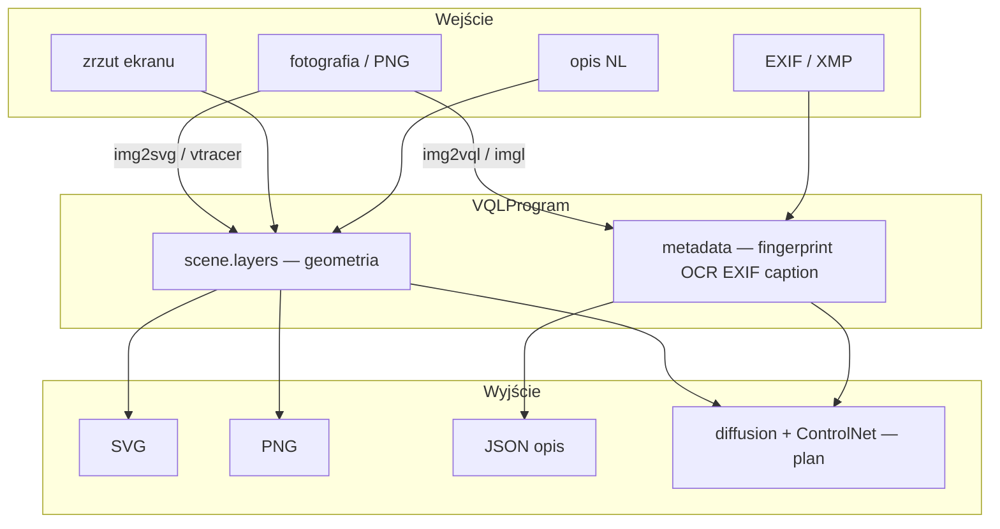

# Fotografia ↔ VQL — roundtrip i jakość konwersji

VQL opisuje obraz jako **`VQLProgram`**: geometria (regiony, ścieżki, bbox UI) + **`metadata`** (fingerprint, OCR, diagnose).  
**Sam EXIF/IPTC bez warstw wizualnych nie wystarczy** do wiernego odtworzenia fotografii — tylko do kontekstu (model aparatu, ISO, GPS).

## Werdykt (2026-06-09)

| Zadanie | Możliwe dziś? | Jakość |
|---------|---------------|--------|
| Opis z obrazu (UI, ilustracja, płaskie barwy) | **Tak** | Dobra–bardzo dobra |
| Opis z obrazu (pejzaż, portret, tekstury) | Częściowo | Niska–średnia (mozaika / wektory) |
| Opis z **samych** EXIF/XMP | Ograniczone | Kontekst techniczny, nie geometria |
| Rekonstrukcja UI / ilustracji z VQL | **Tak** | Dobra (layout); tekst wymaga OCR w renderze |
| Rekonstrukcja płaskich kształtów (vtracer) | **Tak** | MSE ~235 vs ~620 (grid) |
| Rekonstrukcja dowolnej fotografii 1:1 | **Nie** | Przybliżenie kolorystyczne |
| Rekonstrukcja z samych metadanych (bez obiektów) | **Nie** | Pusty canvas / tło |

## Tryby konwersji

| Tryb | Kierunek | Narzędzie | Jakość |
|------|----------|-----------|--------|
| **Parametryczny** | NL → VQL → SVG/PNG | `nl_to_program`, `render_to_svg` | Doskonała |
| **Mozaika kolorów** | PNG → VQL → PNG | `img2svg`, `analyze-window` | Dobra dla płaskich barw |
| **Wektory kolorowe** | PNG → VQL → PNG | `img2svg --method vtracer` | Lepsza dla kształtów |
| **UI + bbox** | PNG → VQL metadata | `img2vql detect`, `adopt-ui` | Dobra dla layoutu |
| **OCR semantyczny** | PNG → VQL + tekst | `adopt-imgl`, imgl | Dobra dla LLM |
| **Fotorealizm** | VQL → zdjęcie | diffusers + ControlNet (plan) | Nie w core |

## Uruchomienie testów

```bash
cd ~/github/oqlos/vql
bash install-dev.sh          # img2svg[vectorize], vql[png]
make test-roundtrip            # pytest + skrypt + raport JSON
# lub ręcznie:
python examples/photo-roundtrip-test.py --out /tmp/vql-roundtrip
pytest tests/test_photo_roundtrip.py -q
```

Wynik: `/tmp/vql-roundtrip/roundtrip_report.json` + PNG/SVG/VQL per próbka.

## Próbki testowe (klasy A / B / C)

Skrypt generuje syntetyczne obrazy — **bez live capture**:

| Klasa | Plik | Opis | Metody testowane |
|-------|------|------|------------------|
| **A** | `nl_draw.*` | NL: koło + prostokąt | `nl_to_program` → render |
| **A** | `sample_ui.*` | Syntetyczny dialog UI | `screenshot_to_program` (grid) |
| **B** | `sample_flat_shapes.*` | Płaskie kształty + tekst | grid, vtracer, contours |
| **B** | `sample_product.*` | Produkt na tle (e-commerce) | grid, vtracer |
| **C** | `sample_gradient.*` | Gradient + szum | grid (słaba wizualnie) |
| **C** | `sample_natural.*` | Niebo + ziemia + blob | grid (przybliżenie) |
| **—** | `metadata_only.*` | Tylko EXIF w metadata, pusty scene | dowód limitu metadanych |

### Wyniki referencyjne (2026-06-09)

| Próbka | Metoda | Obiekty | MSE | Fidelity |
|--------|--------|---------|-----|----------|
| `nl_parametric` | wektor NL | 2 | — | excellent |
| `sample_flat_shapes` | color grid | 166 | 619.9 | good (125/125 kolorów) |
| `sample_flat_shapes_vtracer` | vtracer | 8 | 235.2 | good |
| `sample_product` | color grid | 149 | 818.6 | good (74/74 kolorów) |
| `sample_product_vtracer` | vtracer | 9 | 283.3 | good |
| `sample_gradient` | color grid | 245 | 134.0 | słaba wizualnie |
| `sample_natural` | color grid | 72 | 229.3 | przybliżenie |
| `sample_flat_shapes_contours` | OpenCV | 3 | — | moderate (krawędzie) |
| `ui_screenshot` | grid adopt | 78 | — | moderate |
| `metadata_only` | metadata→PNG | 0 | — | not reconstructible |
| `img2vql_detect` | bbox | — | — | wymaga img2nl |

## Image → VQL (opis z fotografii)

```bash
# Mozaika kolorów
img2svg vql photo.png --out photo.vql.json --grid 20

# Wektoryzacja kolorowa (zalecane dla ilustracji / płaskich barw)
pip install 'img2svg[vtracer]'
img2svg vql photo.png --out photo.vql.json --method vtracer

# Kontury (OpenCV)
pip install 'img2svg[opencv]'
img2svg vql photo.png --out photo.vql.json --method contours

# Screenshot: siatka + fingerprint
uri2vql analyze-window --image photo.png --out app.vql.json --grid 12

# UI bbox + role
img2vql detect photo.png --describe
uri2vql adopt-ui --image photo.png --out ui.vql.json

# OCR + interakcja LLM
uri2vql adopt-imgl --image photo.png --out layout.vql.json --lang eng+pol
```

### Warstwy w `VQLProgram`

| Warstwa / pole | Źródło | Co opisuje |
|----------------|--------|------------|
| `scene.layers[].objects` | img2svg, NL | prostokąty, path, prymitywy |
| `screen_regions` | analyze-window | scalona siatka |
| `ui_elements` | img2vql | bbox + role + relations |
| imgl layers | adopt-imgl | tekst OCR, klikalne elementy |
| `metadata.fingerprint` | img2vql | phash, compare |
| `metadata.exif` | (planowane piexif) | kontekst aparatu — **nie geometria** |
| `metadata.semantic_description` | (planowane VLM) | opis tekstowy sceny |

Przykładowy fragment programu: [photo-roundtrip-sample.vql.json](photo-roundtrip-sample.vql.json).

## VQL → obraz (odtworzenie z metadanych)

```python
from vql import VQLProgram, render_to_svg, render_to_png
import json

program = VQLProgram.from_dict(json.load(open("photo.vql.json")))
svg = render_to_svg(program)
render_to_png(program, "reconstructed.png")  # wymaga vql[png]
```

```bash
dsl2vql -c 'RENDER photo.vql.json OUT reconstructed.svg'
```

**Ograniczenia renderera:** prymitywy wektorowe + mozaika kolorów — bez fotorealistycznych tekstur, ciągłych gradientów i antyaliasingu zdjęcia.

**Tło (0.1.3+):** `trace_to_vql_program` ustawia `scene.background` z dominującego regionu; renderer używa go zamiast białego.

## Macierz możliwości



## Biblioteki — polepszenie jakości

### Image → VQL

| Biblioteka | Rola | Status |
|------------|------|--------|
| **Pillow** | IO, stats | ✅ |
| **OpenCV** | kontury | ✅ `img2svg[opencv]` |
| **vtracer** | wektoryzacja kolorowa | ✅ `img2svg[vtracer]` |
| **potrace** | mono SVG | planowane |
| **scikit-image** | SLIC, watershed | planowane |
| **SAM / GroundingDINO** | maski obiektów | planowane `semantic_regions` |
| **rapidocr / Tesseract / imgl** | OCR | ✅ auto-OCR, adopt-imgl |
| **BLIP-2 / Florence-2 / Qwen-VL** | caption sceny | → `metadata.semantic_description` |
| **imagehash** | fingerprint | ✅ |
| **img2nl** | diagnose, routing | ✅ (wymaga install) |
| **piexif / exiftool** | EXIF ↔ metadata | planowane |

### VQL / metadata → Image

| Biblioteka | Rola | Status |
|------------|------|--------|
| **cairosvg** | SVG → PNG | ✅ `vql[png]` |
| **Playwright** | canvas | ✅ |
| **skia-python / Cairo** | gradienty, AA | planowane |
| **Shapely** | merge regionów | częściowo |
| **diffusers + ControlNet / IP-Adapter** | rekonstrukcja foto | planowane |

### Walidacja roundtrip

| Metryka | Narzędzie | Gdzie |
|---------|-----------|-------|
| MSE orig vs recon | numpy | `photo-roundtrip-test.py` |
| phash distance | imagehash | `fingerprint.py` |
| IoU bbox (UI) | — | planowane CI |
| regresja pytest | pytest | `tests/test_photo_roundtrip.py` |

## Pipeline per use case

### Rysunek / diagram (wektor) — klasa A

```bash
dsl2vql -c 'COMPILE "narysuj czerwone koło"'
dsl2vql -c 'RENDER app.vql.json OUT out.svg'
```

### Zrzut ekranu → opis dla LLM — klasa A

```bash
imgl capture -o screen.png --verify --analyze
uri2vql adopt-imgl --image screen.png --out layout.vql.json
uri2vql query "vql://window/summary?file=layout.vql.json"
```

### Ilustracja / produkt (płaskie barwy) — klasa B

```bash
img2svg vql product.png --out product.vql.json --method vtracer
python -c "from vql import VQLProgram, render_to_png; import json; \
p=VQLProgram.from_dict(json.load(open('product.vql.json'))); render_to_png(p,'out.png')"
```

### Fotografia naturalna — klasa C (przyszłość)

1. Segmentacja (SAM) → `semantic_regions`
2. vtracer per maska → `path` + fill
3. VLM caption → `metadata.semantic_description`
4. EXIF → `metadata.exif` jako prompt context
5. `layout SVG/PNG` → ControlNet → diffusion refine

## CI / Makefile

```makefile
test-roundtrip: venv install-dev
	pytest tests/test_photo_roundtrip.py -q
	python examples/photo-roundtrip-test.py --out /tmp/vql-roundtrip
```

Planowane progi MSE w CI (per klasa próbki) — patrz [TODO](../TODO.md).

## Powiązane

- [window-pipeline.md](window-pipeline.md) — screenshot pipeline
- [img2svg-uri.md](img2svg-uri.md) — wektoryzacja URI
- [vdisplay-imgl-automation.md](vdisplay-imgl-automation.md) — capture dla LLM
- [examples/photo-roundtrip-test.py](../examples/photo-roundtrip-test.py) — skrypt testowy
- [examples/README.md](../examples/README.md) — indeks examples
