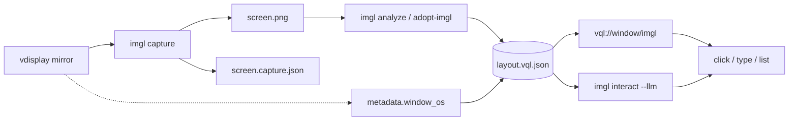

# vdisplay → imgl → VQL — automatyzacja LLM

Ścieżka zalecana do **headless capture** i **automatyzacji przez LLM**: zrzut z wirtualnego display (vdisplay), semantyczny layout (imgl), reprezentacja VQL, akcje przez URI lub `imgl interact`.

## Architektura



| Warstwa | Pakiet | Rola |
|---------|--------|------|
| Capture | **vdisplay** | Zrzut z framebuffera / mirror (bez dialogu GNOME, gdy driver działa) |
| Semantyka | **imgl** | OCR, role elementów, katalog interakcji, provenance |
| IR | **vql** | `VQLProgram` — grid, ui_elements, fingerprint, diagnose |
| Detekcja UI | **img2vql** | Okna, panele, przyciski (`ImglConfig(use_img2vql=True)`) |
| Routing LLM | **img2nl** | `diagnose-window`, `llm_hint`, auto-OCR |

**Uwaga:** `uri2vql capture-screen` **nie** używa vdisplay — to osobna ścieżka (portal / grim / mss). Do automatyzacji LLM używaj `imgl capture`.

## Instalacja

```bash
export IMGL_ROOT=~/github/semcod/imgl
export VDISPLAY_ROOT=~/github/wronai/vdisplay   # opcjonalnie, imgl instaluje sam
bash install-dev.sh
```

`install-dev.sh` gdy `IMGL_ROOT/pyproject.toml` istnieje:

```bash
pip install -e "$IMGL_ROOT[vdisplay]"   # imgl + vdisplay mirror
pip install pytesseract
pip install -e "packages/uri2vql[imgl]"
```

Dodatkowo (pełna detekcja UI w imgl):

```bash
export IMG2NL_ROOT=~/github/wronai/img2nl
pip install -e "$IMG2NL_ROOT[analyze]"
pip install -e packages/img2vql
```

Wayland — driver-level mirror bez portalu:

```bash
sudo usermod -aG video $USER
# wyloguj i zaloguj ponownie
```

## 1. Capture (vdisplay)

```bash
imgl capture -o /tmp/screen.png --verify
# lub capture + VQL w jednym kroku:
imgl capture -o /tmp/screen.png --verify --analyze --lang eng+pol
```

Powstają:

| Plik | Zawartość |
|------|-----------|
| `screen.png` | Zrzut ekranu |
| `screen.capture.json` | `method`, `display`, `monitor`, `region` (provenance vdisplay) |
| `screen.vql.json` | VQLProgram (gdy `--analyze`) |
| `screen.vql.imgl.json` | Cache Scene imgl |

Kolejność backendów w imgl: **vdisplay mirror** → vdisplay+portal → grim/gnome → opcjonalnie vql (`IMGL_CAPTURE_ALLOW_VQL=1`).

Weryfikacja (nie analizuj czarnego PNG):

```bash
imgl diagnose /tmp/screen.png
# oczekuj: worth_analyzing: true
```

## 2. VQL — adopt imgl

Gdy masz już PNG z capture:

```bash
uri2vql adopt-imgl --image /tmp/screen.png --out /tmp/layout.vql.json --lang eng+pol
```

Zapisuje warstwy imgl w VQL: elementy OCR, role (`button`, `input`, …), `scene.relations`, opcjonalnie `metadata.window_os` (korelacja vdisplay ↔ vision).

Pełny pipeline analyze + fingerprint (vql):

```bash
uri2vql analyze-window --image /tmp/screen.png --out /tmp/app.vql.json --grid 12
uri2vql diagnose-window --image /tmp/screen.png --vql-program /tmp/app.vql.json --save
uri2vql query "vql://window/summary?file=/tmp/app.vql.json&live=1&image=/tmp/screen.png"
```

## 3. URI — akcje dla agentów

```bash
# Katalog elementów (numery do kliknięcia)
uri2vql query "vql://window/imgl?action=list&image=/tmp/screen.png&file=/tmp/layout.vql.json"

# Klik / wpisanie tekstu
uri2vql query "vql://window/imgl?action=click&target=button_3&image=/tmp/screen.png&file=/tmp/layout.vql.json"
uri2vql query "vql://window/imgl?action=type&target=input_1&text=hello&image=/tmp/screen.png&file=/tmp/layout.vql.json"
```

REST/MCP: najpierw `adopt-imgl` lub `POST /v1/window/adopt`, potem `vql_query` z URI imgl.

## 4. LLM interact (imgl)

Bezpośrednia automatyzacja NL → akcja na pulpicie:

```bash
# .env: OPENROUTER_API_KEY
imgl interact /tmp/screen.png --llm --lang eng+pol
# lub z wykonaniem kliknięć (ostrożnie):
imgl interact /tmp/screen.png --llm --execute --window region-top
```

Po każdej akcji UI się zmienia — **nowy capture** przed kolejnym krokiem.

## Skrypt demo (vql repo)

```bash
# IMGL_AUTO_CAPTURE=1 → imgl capture (vdisplay) zamiast synthetic PNG
bash examples/img2nl-vql-flow.sh

# Z gotowym zrzutem
bash examples/img2nl-vql-flow.sh /tmp/screen.png /tmp/app.vql.json
```

Zmienne: `IMGL_AUTO_CAPTURE`, `IMGL_WINDOW_SCOPE`, `IMGL_ROOT` — [examples/README.md](../examples/README.md).

## Porównanie ścieżek capture

| Cel | Komenda | Backend |
|-----|---------|---------|
| Automatyzacja LLM, CI, headless | `imgl capture -o screen.png` | vdisplay mirror → portal fallback |
| Szybki test vql bez imgl | `uri2vql capture-screen --interactive` | xdg-desktop-portal |
| Diagnostyka backendów vql | `uri2vql capture-screen --diagnose` | grim, mss, portal, … |
| Capture + VQL jednym krokiem | `imgl capture --analyze` | vdisplay + imgl → `.vql.json` |

## Zmienne środowiskowe (imgl / vdisplay)

| Zmienna | Domyślnie | Opis |
|---------|-----------|------|
| `IMGL_CAPTURE_PREFER_MIRROR` | `1` | Priorytet vdisplay mirror |
| `IMGL_CAPTURE_PORTAL_FALLBACK` | `1` na Wayland | Portal GNOME gdy mirror zawiedzie |
| `IMGL_CAPTURE_SOURCE` | — | Output vdisplay (np. `DP-1`) |
| `IMGL_STRICT_DISPLAY` | wyłączone | Blokuj execute gdy DISPLAY ≠ capture |
| `IMGL_CAPTURE_ALLOW_VQL` | wyłączone | Użyj `uri2vql capture-screen` w łańcuchu imgl |
| `VDISPLAY_ROOT` | `~/github/wronai/vdisplay` | Ścieżka do editable install |

Pełna lista: [imgl docs/capture.md](https://github.com/semcod/imgl/blob/main/docs/capture.md).

## Typowe problemy

| Objaw | Rozwiązanie |
|-------|-------------|
| `vdisplay missing` | `bash install-dev.sh` lub `imgl install vdisplay` |
| `Driver-level capture failed` | `sudo usermod -aG video $USER` + re-login |
| Czarny PNG | `imgl capture --portal` lub uprawnienia Screen Recording |
| `imgl not installed` w uri2vql | `pip install -e "$IMGL_ROOT[vdisplay]"` |
| `No module named img2nl` przy adopt-imgl | `pip install -e "$IMG2NL_ROOT[analyze]"` + img2vql |
| Stary zrzut przy execute | Nowy `imgl capture` — UI się zmieniło |

## Powiązane

- [desktop-capture.md](desktop-capture.md) — `uri2vql capture-screen`, czarny PNG Wayland
- [window-pipeline.md](window-pipeline.md) — pełny przepływ warstw VQL
- [window-uri.md](window-uri.md) — `vql://window/imgl`
- [imgl examples/platforms/gnome-wayland](https://github.com/semcod/imgl/tree/main/examples/platforms/gnome-wayland)
