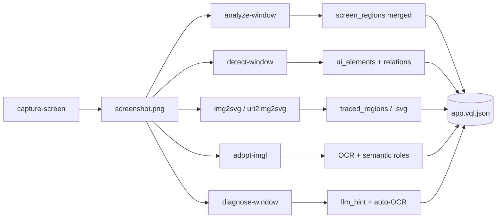

# Window pipeline — od zrzutu do VQL / SVG

Przepływ przetwarzania zrzutu ekranu w ekosystemie VQL.



## Warstwy VQL (layers)

| Warstwa | Źródło | Zawartość |
|---------|--------|-----------|
| `screen_regions` | `analyze-window` | scalone regiony kolorów (merge_regions, nie 144 cell_*) |
| `ui_elements` | `adopt-ui` / img2vql | okna, panele, titlebar, toolbar, przyciski + bbox |
| `traced_regions` | `img2svg vql` | wektoryzacja kolorów lub kontury OpenCV |
| imgl layers | `adopt-imgl` | OCR, role semantyczne, interakcja |

Metadata w `app.vql.json`: `fingerprint`, `scene_class`, `special_hits`, `llm_hint`, `diagnose_recommendation`.

## 1. Capture

```bash
uri2vql capture-screen --interactive --out /tmp/screen.png
uri2vql capture-and-analyze --out app.vql.json --diagnose   # all-in-one
```

→ [desktop-capture.md](desktop-capture.md)

## 2. Analyze (grid + metadata)

```bash
uri2vql analyze-window --image /tmp/screen.png --out /tmp/app.vql.json --grid 12
```

- `merge_regions=True` — scala sąsiednie komórki tego samego koloru
- `skip_if_unchanged` — pomija rebuild gdy fingerprint się zgadza
- zapisuje: `fingerprint`, `scene_class`, `special_hits`, `dominant_colors`

## 3. Detekcja UI (img2vql)

```bash
img2vql detect /tmp/screen.png --describe --locale pl
uri2vql detect-window --image /tmp/screen.png
uri2vql adopt-ui --image /tmp/screen.png --out /tmp/ui.vql.json
```

Role: `window`, `panel`, `titlebar`, `toolbar`, `button`, `icon_button`.
Relacje: `scene.relations` z `contains` (window > panel > button).

## 4. Wektoryzacja (img2svg)

```bash
# CLI
img2svg svg /tmp/screen.png --out /tmp/screen.svg --grid 24
img2svg vql /tmp/screen.png --out /tmp/screen.vql.json

# URI
uri2img2svg query "img2svg://svg?path=/tmp/screen.png&out=/tmp/screen.svg"

# DSL
dsl2img2svg -c 'VECTORIZE PATH /tmp/screen.png OUT /tmp/screen.svg GRID 24'
```

→ [img2svg-uri.md](img2svg-uri.md)

## 5. Diagnose + auto-OCR

```bash
uri2vql diagnose-window --image /tmp/screen.png --locale pl --translate-mode auto
uri2vql diagnose-window --image /tmp/screen.png --vql-program app.vql.json --save
```

Auto-OCR (`img2vql[ocr]`): gdy `text_likelihood` ale brak tekstu → rapidocr → imgl fallback.
Zapisuje `special_hits.ocr_preview` w metadata programu.

## 6. Fingerprint + refresh

```bash
uri2vql compare-window --image /tmp/screen.png --vql-program app.vql.json
uri2vql refresh-window --vql-program app.vql.json --image /tmp/screen.png
uri2vql query "vql://window/summary?file=app.vql.json&live=1&image=/tmp/screen.png"
```

## 7. REST + MCP (agenci)

```bash
# REST (port 8216)
curl -X POST http://localhost:8216/v1/window/detect \
  -H 'Content-Type: application/json' \
  -d '{"image":"/tmp/screen.png","locale":"pl"}'

# MCP: vql_detect_ui, vql_diagnose_window, vql_compare_window, vql_refresh_window_metadata
```

→ [rest-window-api.md](rest-window-api.md)

## 8. OCR + semantyka (imgl, opcjonalnie)

```bash
uri2vql adopt-imgl --image /tmp/screen.png --out layout.vql.json --lang eng+pol
bash examples/img2nl-vql-flow.sh   # z imgl enrichment gdy zainstalowany
```

## Przykłady (scripts)

```bash
bash examples/full-pipeline.sh
VQL_TEST_IMAGE=/tmp/screen.png bash examples/full-pipeline.sh
bash examples/img2nl-vql-flow.sh /tmp/screen.png
```

→ [examples/README.md](../examples/README.md)

## Ograniczenia

- **img2vql detect** — heurystyki bez OCR na labelach przycisków (→ imgl lub auto-OCR)
- **img2svg regions** — mozaika kolorów, nie potrace/vtracer
- **Wayland capture** — `--interactive` lub uprawnienia Screen Recording
