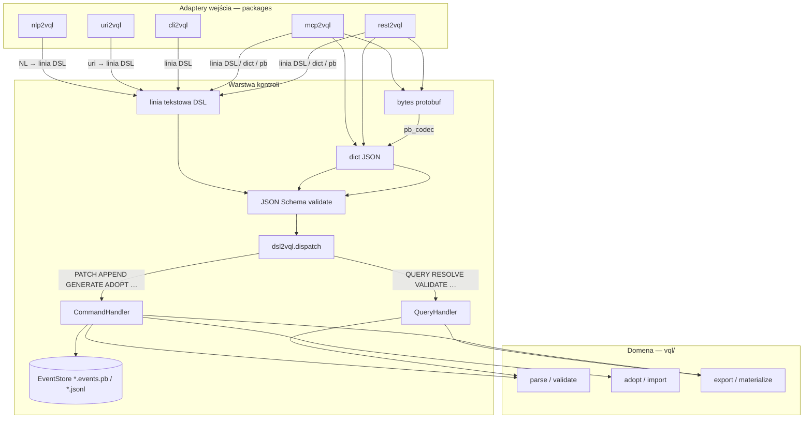

# Prompt: warstwa kontroli `*2vql`

> Szablon do wklejenia w Cursor/LLM. Zamień `vql` na nazwę paczki (np. `vql`, `testql`, `oql`).
> Przykład: `vql` → `vql` daje `mcp2vql`, `dsl2vql`, …

## Tabela substytucji

| Placeholder | vql | nlp2dsl | testql |
|-------------|------|---------|--------|
| `vql` | vql | nlp2dsl | testql |
| manifest | `app.vql.json` | `app.vql.json` (wspólny) | `app.testql.less` |
| EventStore | `app.vql.events.pb` | `app.nlp2dsl.events.pb` | `app.testql.events.pb` |
| REST port | `8216` | `8212` | `8214` |
| profil verbów | manifest DSL | runtime / NL | manifest DSL |
| referencja golden | `packages/dsl2vql/` | `packages/dsl2nlp2dsl/` | — |

## Najpierw przeczytaj (przed implementacją)

1. `packages/README.md` monorepo — indeks paczek i diagram przepływu
2. Istniejące `packages/*2vql/` — rozszerz, nie buduj od zera
3. Lifecycle domeny w `vql/` — verby wynikają z niego, nie z szablonu
4. Referencje golden: `vql` (manifest), `nlp2dsl` (runtime + shims `control.py`)

---

## Prompt (kopiuj od linii poniżej)

```
Zrefaktoryzuj / utwórz warstwę kontroli dla paczki `vql` w monorepo.

## Cel

Paczka `vql` ma być sterowana wyłącznie przez standaryzowany DSL i bus CQRS/ES.
Adaptery wejścia (MCP, REST, CLI, URI, NL) nie zawierają logiki domenowej — tylko delegują do `dsl2vql`.

## Wymagane paczki w `packages/`

| Paczka | Rola | Dozwolone zależności |
|--------|------|----------------------|
| `dsl2vql` | Grammar DSL + **JSON Schema** + **Protobuf** + CQRS bus + EventStore | `vql` (core), `protobuf`, `jsonschema`, stdlib; **manifest DSL**: jawne `uri2vql`, `nlp2vql` w handlerach (lazy import preferowany) |
| `uri2vql` | `uri://` → linia DSL → `dsl2vql.dispatch()` | `dsl2vql` |
| `nlp2vql` | NL → linia DSL (bez side-effect) → opcjonalnie `dispatch()` | `dsl2vql` |
| `cli2vql` | Shell REPL / exec / run script | `dsl2vql` |
| `mcp2vql` | Serwer MCP (stdio), narzędzia = cienkie wrappery DSL | `dsl2vql` |
| `rest2vql` | REST API (FastAPI), endpointy = cienkie wrappery DSL | `dsl2vql` |

**Nazewnictwo złożonego `vql`** (np. `nlp2dsl`):
- Paczki: `dsl2nlp2dsl`, `uri2nlp2dsl`, `nlp2nlp2dsl` (nie `nlp2dsl2nlp2dsl`)
- MCP tools: pełna nazwa produktu — `nlp2dsl_run_command`, nie `dsl_run_command`

Reguły twarde:
- JEDYNY punkt wykonania mutacji: `dsl2vql.dispatch()` → `CommandHandler`
- Query (read-only): `QueryHandler` — bez zapisu eventów
- Command (write): handler wykonuje się **przed** append do EventStore
- Adaptery NIE importują się nawzajem (wyjątek: wszystkie → `dsl2vql`)
- Logika domenowa (parse, validate, export, adopt, konwertery) zostaje w `vql/`, nie w adapterach
- Ta sama linia DSL daje identyczny wynik z CLI, URI, MCP, REST

## Schemat przepływu (docelowy)



## Schemat URI (dwa poziomy)

1. **Adres zasobu** (target komendy):
   `vql://block/entity/Contact?file=app.vql.json`

2. **Adres komendy DSL** (opcjonalnie, uri2vql):
   `vql://cmd/QUERY?target=vql://block/app&file=app.vql.json&format=less`

`uri2vql` dekoduje URI → **jedna linia DSL** → `dsl2vql.dispatch()`.

## DSL: tekst + Schema + Protobuf

Warstwa `dsl2vql` utrzymuje **trzy reprezentacje** tej samej komendy:

| Reprezentacja | Pliki | Rola |
|---------------|-------|------|
| **Tekst** (canonical UX) | `*.dsl`, REPL, CLI | czytelna linia: `QUERY …` |
| **JSON Schema** | `schema/commands/*.schema.json` | walidacja pól, dokumentacja, codegen |
| **Protobuf** | `proto/dsl2vql/v1/*.proto` | serializacja REST/MCP/ES, wersjonowanie |

### Przepływ kodowania (dwa wejścia, jeden bus)

```text
# Wejście tekstowe (CLI, URI, MCP text/plain)
linia DSL → grammar.py → dict → jsonschema → handler → DslResult

# Wejście strukturalne (REST/MCP json lub protobuf)
dict / DslEnvelope bytes → pb_codec (jeśli pb) → jsonschema → handler → DslResult

# Wyjście opcjonalne
DslResult → to_text() / to_json() / SerializeToString (REST/MCP pb)
```

Reguły:
- **Schema jest źródłem prawdy** dla pól komend (nazwy, typy, required).
- **Protobuf odzwierciedla Schema** — każdy `verb` ma message `XxxCommand` / `XxxQuery`.
- Tekst DSL to **składnia cukrowa** nad Schema (nie odwrotnie).
- EventStore preferuje **protobuf** (`*.events.pb` lub base64 w jsonl); jsonl dozwolony w dev.
- REST/MCP akceptują: `text/plain` (linia DSL), `application/json` (dict), `application/x-protobuf`.
- Protobuf na wejściu busa jest **opcjonalny** — walidacja zawsze przez Schema (dict).

### Przykład Schema (`schema/commands/query.schema.json`)

```json
{
  "$id": "dsl2vql/commands/query",
  "type": "object",
  "required": ["verb", "target"],
  "properties": {
    "verb": { "const": "QUERY" },
    "target": { "type": "string", "format": "uri", "pattern": "^vql://" },
    "file": { "type": "string" },
    "format": { "enum": ["json", "yaml", "less"], "default": "json" }
  },
  "additionalProperties": false
}
```

### Przykład Protobuf — `command.proto` (bez Result/Event)

```protobuf
syntax = "proto3";
package dsl2vql.v1;

message QueryCommand {
  string target = 1;   // vql://block/...
  string file = 2;
  string format = 3;   // json|yaml|less
}

message PatchCommand {
  string target = 1;
  string file = 2;
  string with_path = 3;
  bytes with_content = 4;
}

message DslEnvelope {
  string verb = 1;     // QUERY | PATCH | VALIDATE | ...
  oneof body {
    QueryCommand query = 10;
    PatchCommand patch = 11;
    // … pozostałe komendy
  }
  string default_file = 20;
  string correlation_id = 21;
}
```

### Przykład Protobuf — `result.proto` (osobny plik)

```protobuf
syntax = "proto3";
package dsl2vql.v1;

import "dsl2vql/v1/command.proto";

message DslResult {
  bool ok = 1;
  string verb = 2;
  string output = 3;
  bytes data_json = 4;
  string error = 5;
  string event_id = 6;   // Commands only
}

message DslEvent {
  string id = 1;
  int64 ts_unix = 2;
  DslEnvelope command = 3;
  DslResult result = 4;
  string correlation_id = 5;
}
```

**Wersjonowanie proto:** nowe pola = nowe numery; `v2/` tylko przy breaking change.

### Generacja kodu (oczekiwana)

```bash
# w packages/dsl2vql/
bash scripts/generate-proto.sh   # preferowane: grpc_tools.protoc
# lub: buf generate
python -m dsl2vql.codegen      # schema → pydantic (Faza 5)
```

Skrypt `scripts/generate-proto.sh` (wzorzec):

```bash
#!/usr/bin/env bash
set -euo pipefail
ROOT="$(cd "$(dirname "$0")/.." && pwd)"
python3 -m grpc_tools.protoc -I "$ROOT/proto" --python_out="$ROOT/src" \
  "$ROOT/proto/dsl2vql/v1/command.proto" \
  "$ROOT/proto/dsl2vql/v1/result.proto"
```

Opcjonalnie `buf.yaml`:

```yaml
version: v2
modules:
  - path: proto
    name: buf.build/oqlos/dsl2vql
```

**WAŻNE — ścieżka importów protobuf:**
- `package dsl2vql.v1;` w `.proto` → wygenerowane pliki **muszą** trafić do `src/dsl2vql/v1/*_pb2.py`
- **NIE** używaj `src/dsl2vql/gen/` — `protoc` generuje importy `from dsl2vql.v1 import …` i `gen/` łamie runtime
- Po generacji dodaj `src/dsl2vql/v1/__init__.py`

Wygenerowane / ręczne moduły:
- `src/dsl2vql/v1/` — `*_pb2.py` z `.proto`
- `src/dsl2vql/schema/commands/` — `*.schema.json` (wewnątrz `src/`, nie obok!) + `schema_registry.py`
- `src/dsl2vql/pb_codec.py` — dict ↔ `DslEnvelope` / `DslResult` (osobno od `codec.py`)
- `src/dsl2vql/result.py` — `DslResult` dataclass (**osobny plik** — unika cykli importów)
- `src/dsl2vql/engine.py` — **opcjonalny shim** wstecznej kompatybilności (re-export z `bus.py`)

### `pyproject.toml` (fragment)

```toml
[project]
dependencies = [
    "vql>=1.0.0",
    "protobuf>=5.0",
    "jsonschema>=4.0",
    # manifest DSL (vql): jawne zależności handlerów:
    # "uri2vql>=0.1.0", "nlp2vql>=0.1.0",
]

[project.optional-dependencies]
codegen = ["grpcio-tools>=1.60"]
dev = ["pytest>=8.0"]

[tool.setuptools.package-data]
"dsl2vql" = ["schema/commands/*.json"]
```

## Grammar DSL tekstowa (minimum)

Jedna linia = jedna komenda. Komentarz: `#`.

**Verby nie są uniwersalne** — wynikają z lifecycle domeny `vql`:

| Profil domeny | Przykładowe Query | Przykładowe Command |
|---------------|-------------------|---------------------|
| Manifest DSL (`vql`, `oql`) | `QUERY`, `RESOLVE`, `VALIDATE` | `PATCH`, `APPEND`, `MATERIALIZE`, `GENERATE`, `ADOPT`, `CONVERT` |
| Runtime / NL (`nlp2dsl`, serwisy) | `ORIENT`, `PARSE`, `PLAN`, `VALIDATE`, `HEALTH`, `ACTIONS`, `RESOLVE` | `EXECUTE`, `SIMULATE`, `GENERATE`, `CHAT`, `DRAFT`, `OBSERVE`, `COMPOSE` |

Zasada: najpierw wypisz lifecycle domeny (np. `parse → plan → validate → execute`), potem mapuj na Query/Command.

Przykłady (manifest DSL — `vql`):
```text
QUERY vql://block/app?file=app.vql.json FORMAT json
VALIDATE app.vql.json
PATCH vql://block/entity/Contact?file=app.vql.json WITH contact.patch.less
APPEND app.vql.json WITH workflow.fragment.less
GENERATE "CRM z kontaktami" OUT app.vql.json
ADOPT . OUT app.vql.json
CONVERT scenarios/test.oql OUT workflow.less
RESOLVE "pokaż workflow install" FILE app.vql.json
```

## CQRS / EventStore

- `QueryResult` / `CommandResult`: protobuf `DslResult` (+ opcjonalny JSON export)
- `Event`: protobuf `DslEvent` (command + result + metadata)
- Store: `app.vql.events.pb` (preferowany) lub `app.vql.events.jsonl` (dev fallback)
- Format `.pb`: ramki length-prefixed (`uint32_be + protobuf_bytes`); replay czyta sekwencyjnie
- Format `.jsonl`: jedna linia JSON na event; opcjonalne pole `"pb": "<base64 DslEvent>"` dla audytu
- Replay: `dsl2vql replay --file app.vql.json` (odczyt sekwencji `DslEvent`)
- Walidacja przed dispatch: **schema JSON** → handler (protobuf opcjonalny na wejściu REST/MCP)
- **Kolejność CQRS**: handler wykonuje się **przed** append do EventStore (nie odwrotnie)

## Kontrakty adapterów

### cli2vql / dsl2vql (dual-mode CLI)

**Legacy** (wsteczna kompatybilność — bez subcommand):
```bash
dsl2vql -c 'QUERY vql://block/app'
dsl2vql script.dsl --file app.vql.json
```

**Subcommands** (nowe — pierwszy arg z `_SUBCOMMANDS`):
```bash
cli2vql shell [--file app.vql.json]
cli2vql exec 'QUERY vql://block/app'
cli2vql run script.dsl
dsl2vql validate-schema
dsl2vql encode 'QUERY vql://block/app' --format protobuf
dsl2vql decode --input command.pb --format protobuf
dsl2vql replay --file app.vql.json
```

Wzorzec argparse: jeśli `argv[0] in _SUBCOMMANDS` → `_main_subcommand()`, inaczej `_main_legacy()` (unika kolizji positional `script` z subcommands).

### uri2vql

**Poziom dojrzałości:**
- **minimal** (vql): `uri.py`, `query.py`, `patch.py`, `resolve.py` — handlery w `dsl2vql`
- **pełny** (nlp2dsl): + `decode.py` (`uri → linia DSL`), `run --uri`

```bash
uri2vql decode --uri 'vql://cmd/QUERY?...'     # → linia DSL
uri2vql run --uri 'vql://cmd/PATCH?...'       # decode + dispatch
uri2vql resolve "pokaż app" --file app.vql.json
```

### nlp2vql

Jeśli `nlp2vql` już istnieje (np. `nlp2vql` z `apply.py`, `pipeline.py`) — dodaj `to_dsl()` / `apply_nl()` delegujące do `dispatch()`, nie przenoś całej logiki NL do busa.

```bash
nlp2vql to-dsl "validate app.vql.json"          # tylko DSL, bez wykonania
nlp2vql apply "validate app.vql.json"           # to-dsl + dispatch
nlp2vql generate "CRM" --out app.vql.json
```

### mcp2vql

```bash
mcp2vql serve
```

Narzędzia MCP (minimum DSL):
- `{product}_run_dsl(script: str, default_file: str = "")` — `{product}` = pełna nazwa (`vql`, `nlp2dsl`)
- `{product}_run_command(command: str, default_file: str = "")`
- `{product}_run_command_pb(envelope_bytes: bytes) -> bytes`
- `{product}_to_dsl(prompt: str) -> str`

**Legacy granular tools** (dozwolone obok DSL): np. `vql_query`, `vql_patch`, `vql_validate` — zachowaj dla wstecznej kompatybilności MCP klientów; nowe integracje preferują `{product}_run_command`.

### rest2vql

```bash
rest2vql serve --port 8xxx
```

**Tabela portów** (rezerwa `82xx`):

| Produkt | Port |
|---------|------|
| vql | 8216 |
| nlp2dsl | 8212 |
| testql | 8214 |

Endpointy (minimum):
- `POST /v1/dsl` — `text/plain` | `application/json` | `application/x-protobuf` (`DslEnvelope`)
- `POST /v1/commands` — alias; body zgodny ze Schema
- `GET /v1/schema/{verb}` — JSON Schema komendy
- `GET /v1/proto` — descriptor / link do `.proto`
- `GET /v1/events?file=app.vql.json` — stream `DslEvent` (pb lub json)
- `GET /health`

## Co przenieść do `vql/` (core)

Jeśli logika jest w adapterze, przenieś do core:
- skanery adopt → `vql/adopt/scanner/`
- konwertery formatów → `vql/importers/`
- parse/validate/export → już w `vql/`

Adapter zostaje cienkim mostem.

## Migracja istniejących paczek `packages/` (monorepo z LLM)

Gdy monorepo ma już paczki SDK korzystające z LLM / env2llm — **nie przenoś ich od razu do `dsl2vql`**.
Zamiast tego dodaj cienki shim `control.py` delegujący do busa:

```python
# packages/foo/src/foo/control.py
def dispatch_validate(**kwargs) -> dict:
    from dsl2vql import dispatch
    return dispatch('VALIDATE …').to_dict()
```

Wzorzec (sprawdzony na `nlp2dsl`):
| Istniejąca paczka | Verb DSL | Plik shim |
|-------------------|----------|-----------|
| kontrakty / drafty LLM | `DRAFT` | `dsl-contracts/control.py` |
| walidacja runtime | `VALIDATE` | `dsl-validate/control.py` |
| artefakty / registry | `OBSERVE` | `*-artifacts/control.py` |
| compose / deploy | `COMPOSE` | `*-stack/control.py` |
| legacy MCP | delegacja | `vql-mcp/server.py` → `mcp2vql` + zachowaj stare narzędzia HTTP |

Kolejność `install-dev.sh` (po paczkach SDK, przed integracjami):
`dsl2vql` → `uri2vql` → `nlp2vql` → `cli2vql` → `mcp2vql` → `rest2vql` → legacy `vql-mcp`

## Reguły importów (unikaj cykli)

- `DslResult` w **`result.py`** — nigdy w `bus.py` jeśli importują go `handlers/`
- `handlers/` importują `result.py`, **nie** `bus.py`
- `bus.py` robi **lazy import** handlerów wewnątrz `_dispatch_cmd()`
- `uri2vql` → `dsl2vql`; `nlp2vql` → `dsl2vql`; adaptery **nie** importują się nawzajem
- `dsl2vql` **nie importuje** `uri2vql` na poziomie modułu — tylko lazy w handlerze `RESOLVE` (wyjątek: jawne deps w `pyproject.toml` jak w `vql` jest OK, jeśli handler ich wymaga)

## Struktura katalogów (oczekiwana)

```
packages/
  dsl2vql/
    proto/dsl2vql/v1/
      command.proto       # DslEnvelope, *Command, *Query
      result.proto        # DslResult, DslEvent
    src/dsl2vql/
      schema/commands/    # *.schema.json — MUSI być w src/ (package-data)
      v1/                 # wygenerowane *_pb2.py (protoc → --python_out=src)
      grammar.py          # tekst DSL → dict
      codec.py            # validate(schema); encode/decode text
      pb_codec.py         # dict ↔ DslEnvelope / DslResult protobuf
      result.py           # DslResult dataclass (bez cykli)
      engine.py           # opcjonalny shim: re-export dispatch z bus.py
      schema_registry.py  # verb → JSON Schema
      bus.py              # dispatch(str | dict | bytes)
      events.py           # EventStore (*.pb length-prefixed + jsonl)
      handlers/           # query.py, command.py
      cli.py              # dual-mode: legacy + subcommands
    scripts/generate-proto.sh
    buf.yaml              # opcjonalnie
    pyproject.toml
    tests/
      test_vql.py
      test_protobuf.py
      test_parity.py
  uri2vql/src/uri2vql/
    uri.py
    decode.py             # pełny profil; opcjonalny w minimal
    cli.py
  nlp2vql/src/nlp2vql/
    to_dsl.py             # lub apply.py jeśli pakiet już istnieje
    cli.py
  cli2vql/src/cli2vql/
    shell.py
    cli.py
  mcp2vql/src/mcp2vql/
    server.py
    cli.py
  rest2vql/src/rest2vql/
    app.py
    cli.py
```

## Kryteria akceptacji (must pass)

1. **Parity**: ta sama komenda (tekst / JSON / protobuf) → ten sam `DslResult` z:
   - `cli2vql exec` / `dsl2vql -c`
   - `uri2vql run`
   - `mcp2vql` tool `{product}_run_command`
   - `rest2vql` POST `/v1/dsl`

2. **Schema** (fazowo):
   - **Faza 0 minimum**: `QUERY`, `VALIDATE`, główny Command (`PATCH` lub `EXECUTE`)
   - **Faza 4**: wszystkie publiczne verby mają `*.schema.json`
   - `dsl2vql validate-schema` — Faza 0: sprawdza `verb const` w registry; Faza 5: pełny audit `handler verb ⇒ schema istnieje`

3. **Protobuf**: `dsl2vql encode/decode` round-trip: tekst → pb → tekst (semantycznie równoważne).

4. **Separacja**: `nlp2vql to-dsl` nie mutuje plików; mutacja tylko przez `dispatch()`.

5. **CQRS**: Query nie zapisują eventów; Command appenduje `DslEvent` (protobuf) **po** handlerze.

6. **Brak cykli**: adaptery nie importują `vql/cli` ani siebie nawzajem.

7. **Testy**:
   ```bash
   pytest packages/dsl2vql/tests packages/uri2vql/tests \
          packages/nlp2vql/tests packages/cli2vql/tests \
          packages/mcp2vql/tests packages/rest2vql/tests -q
   ```
   + `test_parity.py` (offline: HEALTH/VALIDATE; runtime z backendem: EXECUTE/PATCH)

8. **Dokumentacja**: każdy pakiet ma README; zaktualizuj `packages/README.md` (indeks + diagram).

9. **Manifest** (jeśli dotyczy): wpisy w `app.vql.json`:
   - `interface[type="cli"] page[name="dsl2vql"]` + `entry: dsl2vql.cli:main`
   - `interface[type="cli"] page[name="cli2vql"]`
   - `interface[type="cli"] page[name="nlp2vql"]`
   - `interface[type="cli"] page[name="uri2vql"]`
   - `interface[type="mcp"] page[name="mcp2vql"]`
   - `interface[type="api"] page[name="rest2vql"]` + `port: 8xxx`
   - opcjonalnie legacy `vql-mcp` jako drugi `page` pod `interface[type="mcp"]`

## Checklist przed „done”

- [ ] Diagram mermaid w `packages/README.md` zgodny z implementacją
- [ ] `dispatch()` jedyny punkt mutacji; adaptery cienkie
- [ ] `result.py` osobno; brak cykli importów
- [ ] Protobuf w `src/dsl2vql/v1/`, nie `gen/`
- [ ] `validate-schema` przechodzi (Faza 0 minimum)
- [ ] `encode/decode` round-trip dla głównych verbów
- [ ] Dual-mode CLI bez kolizji argparse
- [ ] `engine.py` shim jeśli był stary import `engine`
- [ ] MCP: `{product}_run_command` + legacy tools zachowane jeśli były
- [ ] REST port z tabeli; `GET /health` działa
- [ ] `pytest packages/ -q` green
- [ ] Manifest `app.vql.json` zaktualizowany

## Fazy implementacji

| Faza | Zakres |
|------|--------|
| 0 | `proto/` + `schema/` (minimum verbów) + `codec.py` + `grammar.py` |
| 1 | `dsl2vql` bus + handlers + przepięcie `cli2vql` + `engine.py` shim |
| 2 | `uri2vql` decode→DSL; `nlp2vql` to-dsl; usunąć direct calls |
| 3 | `mcp2vql` + `rest2vql` (text + json + protobuf) |
| 4 | EventStore protobuf + replay + pełne schema + `control.py` shims |
| 5 | `python -m dsl2vql.codegen` → `models.py` (pydantic); test parity runtime |

### Szkielet `test_parity.py`

```python
"""Parity: ta sama linia DSL → ten sam wynik (offline verby)."""

from dsl2vql import dispatch

def test_parity_text_vs_dict() -> None:
    line = "VALIDATE app.vql.json"
    r1 = dispatch(line)
    r2 = dispatch({"verb": "VALIDATE", "path": "app.vql.json"})
    assert r1.ok == r2.ok
    assert r1.verb == r2.verb

# Faza 5: test_parity_across_adapters (wymaga serwisu / plików fixture)
```

## Nie rób

- Nie duplikuj logiki domenowej w adapterach.
- Nie wołaj handlerów z `nlp2vql` / `uri2vql` omijając Schema + bus.
- Nie pomijaj `rest2vql` — brak = fail kryteriów.
- Nie rozjedzaj Schema i Protobuf — zmiana verb wymaga obu + testu round-trip.
- Nie commituj bez uruchomienia testów.
- Nie umieszczaj `schema/` poza `src/dsl2vql/` — `importlib.resources` nie znajdzie plików.
- Nie umieszczaj `DslResult` / `DslEvent` w `command.proto` — tylko w `result.proto`.
- Nie wymuszaj pełnego `decode.py` w `uri2vql` jeśli minimal profil wystarczy (jak `vql`).

Na końcu podaj: listę plików, diagram przepływu po refaktorze, wynik testów, znane luki Fazy 5.
```

---

## Przykład wypełniony: `vql` = `vql`

Zamień w prompcie:
- `vql` → `vql`, `{product}` → `vql`
- manifest → `app.vql.json`
- EventStore → `app.vql.events.pb` (+ opcjonalny `.jsonl` w dev)
- Schema → `packages/dsl2vql/src/dsl2vql/schema/commands/*.schema.json`
- Proto → `packages/dsl2vql/proto/dsl2vql/v1/*.proto`
- REST port → `8216`
- Referencja golden → `packages/dsl2vql/`, `packages/rest2vql/`

Oczekiwane paczki:
`dsl2vql`, `uri2vql`, `nlp2vql`, `cli2vql`, `mcp2vql`, `rest2vql`

Wyjątki referencyjne:
- `dsl2vql/pyproject.toml` zależy od `uri2vql`, `nlp2vql`
- `engine.py` shim; dual-mode CLI (`-c` legacy + subcommands)
- `uri2vql` minimal (bez `decode.py`); `nlp2vql` używa `apply.py`
- MCP: `vql_run_command` + legacy `vql_query`, `vql_patch`, …
- Schema: 7 plików na 12 verbów (Faza 4 w toku)

---

## Przykład wypełniony: `vql` = `nlp2dsl`

Zamień w prompcie:
- `vql` → `nlp2dsl`, `{product}` → `nlp2dsl`
- manifest → `app.vql.json` (wspólny z env2llm)
- EventStore → `app.nlp2dsl.events.pb`
- Verby → lifecycle runtime: `PARSE`, `PLAN`, `VALIDATE`, `EXECUTE`, `SIMULATE`, `GENERATE`, …
- REST port → `8212`
- Istniejące paczki LLM → shim `control.py` (nie pełna migracja od razu)
- Referencja golden → `packages/dsl2nlp2dsl/`

Oczekiwane paczki:
`dsl2nlp2dsl`, `uri2nlp2dsl`, `nlp2nlp2dsl`, `cli2nlp2dsl`, `mcp2nlp2dsl`, `rest2nlp2dsl`

Uwaga nazewnictwa: `nlp2nlp2dsl` (nie `nlp2dsl2nlp2dsl`); MCP tools: `nlp2dsl_run_command`.

---

## Przykład wypełniony: `vql` = `testql`

Zamień w prompcie:
- `vql` → `testql`, `{product}` → `testql`
- manifest → `app.testql.less`
- REST port → `8214`
- Profil → manifest DSL (jak `vql`, skrócona lista verbów: `QUERY`, `VALIDATE`, `PATCH`, `GENERATE`)
- Brak legacy MCP — czysta implementacja od zera

Oczekiwane paczki:
`dsl2testql`, `uri2testql`, `nlp2testql`, `cli2testql`, `mcp2testql`, `rest2testql`
