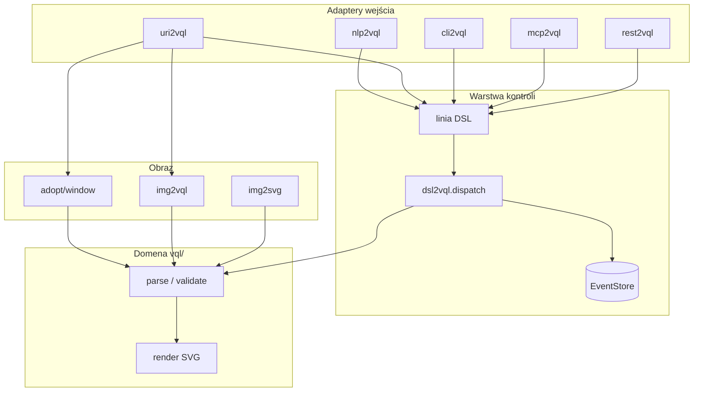

# VQL tooling packages (`*2vql`)

Warstwy **sterowania VQL** — język wektorowego opisu fotografii, rysunków i zrzutów ekranu.

**Dokumentacja:** [../docs/README.md](../docs/README.md)

## Pakiety sterowania

| Pakiet | Rola | Port |
|--------|------|------|
| **dsl2vql** | DSL sterowania (QUERY, VALIDATE, RENDER, GENERATE, COMPILE, …) | — |
| **uri2vql** | `vql://` URI — query, patch, `window/*`, capture | — |
| **nlp2vql** | NL → linia DSL → opcjonalnie `dispatch()` | — |
| **cli2vql** | Shell REPL / exec / run script | — |
| **mcp2vql** | Serwer MCP (stdio) | — |
| **rest2vql** | REST API (FastAPI) — POST `/v1/dsl` | **8216** |

## Pakiety obrazu

| Pakiet | Rola | README |
|--------|------|--------|
| **img2vql** | Detekcja UI (okna, przyciski) + img2nl diagnose | [img2vql/README.md](img2vql/README.md) |
| **img2svg** | Raster → SVG / VQL wektoryzacja | [img2svg/README.md](img2svg/README.md) |
| **uri2img2svg** | `img2svg://` URI query | [uri2img2svg/README.md](uri2img2svg/README.md) |
| **dsl2img2svg** | DSL `VECTORIZE` / `TO_VQL` | [dsl2img2svg/README.md](dsl2img2svg/README.md) |

## Logika w `vql/` (core)

| Funkcja | Lokalizacja |
|---------|-------------|
| Schema IR (`VQLProgram`) | `src/vql/schema/program.py` |
| NL → program | `src/vql/compiler/nl_to_vql.py` |
| Screenshot adopt (grid) | `src/vql/adopt/window.py` |
| Render SVG/PNG | `src/vql/renderers/svg.py` |
| Kształty / kolory | `src/vql/drawing/` |

## Przepływ



## Verby DSL (lifecycle VQL)

| Query | Command |
|-------|---------|
| `QUERY`, `VALIDATE`, `RENDER`, `RESOLVE` | `GENERATE`, `COMPILE`, `PATCH`, `EXPORT` |

Przykłady:

```text
QUERY vql://program?file=app.vql.json FORMAT json
QUERY vql://window/summary?file=app.vql.json
VALIDATE app.vql.json
RENDER app.vql.json OUT preview.svg
COMPILE "narysuj czerwone koło"
```

## Instalacja (dev)

```bash
bash install-dev.sh
```

## Testy

```bash
pytest tests/ packages/ -q
```

## Przykłady

```bash
bash examples/full-pipeline.sh
bash examples/img2nl-vql-flow.sh
```

→ [examples/README.md](../examples/README.md)

## Powiązane

- [docs/README.md](../docs/README.md)
- [docs/window-pipeline.md](../docs/window-pipeline.md)
- [docs/window-uri.md](../docs/window-uri.md)
- [docs/img2svg-uri.md](../docs/img2svg-uri.md)
- [docs/rest-window-api.md](../docs/rest-window-api.md)
- [TODO.md](../TODO.md)
