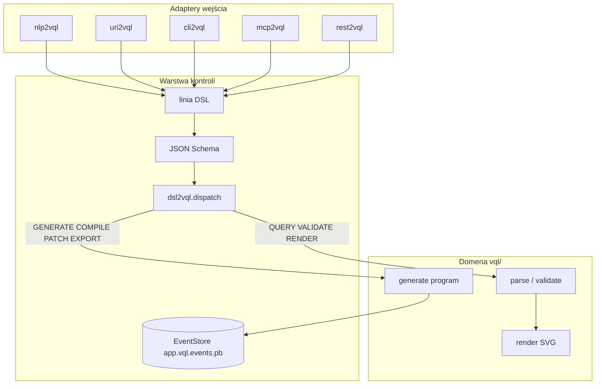

# VQL tooling packages (`*2vql`)

Warstwy **sterowania VQL** — język wektorowego opisu fotografii i rysunków.

## Pakiety

| Pakiet | Rola | Port |
|--------|------|------|
| **dsl2vql** | DSL sterowania (QUERY, VALIDATE, RENDER, GENERATE, COMPILE, …) | — |
| **uri2vql** | `vql://` URI — query, patch | — |
| **nlp2vql** | NL → linia DSL → opcjonalnie `dispatch()` | — |
| **cli2vql** | Shell REPL / exec / run script | — |
| **mcp2vql** | Serwer MCP (stdio) | — |
| **rest2vql** | REST API (FastAPI) — POST `/v1/dsl` | **8216** |

## Logika w `vql/` (core)

| Funkcja | Lokalizacja |
|---------|-------------|
| Schema IR (`VQLProgram`) | `src/vql/schema/program.py` |
| NL → program | `src/vql/compiler/nl_to_vql.py` |
| Walidacja | `src/vql/validation/spec.py` |
| Render SVG/PNG | `src/vql/renderers/svg.py` |
| Kształty / kolory | `src/vql/drawing/` |

## Przepływ



## Verby DSL (lifecycle VQL)

| Query | Command |
|-------|---------|
| `QUERY`, `VALIDATE`, `RENDER`, `RESOLVE` | `GENERATE`, `COMPILE`, `PATCH`, `EXPORT` |

Przykłady:

```text
QUERY vql://program?file=app.vql.json FORMAT json
VALIDATE app.vql.json
RENDER app.vql.json OUT preview.svg
COMPILE "narysuj czerwone koło"
GENERATE "narysuj kota" OUT app.vql.json
PATCH vql://scene FILE app.vql.json WITH patch.json
EXPORT app.vql.json OUT out.png FORMAT png
```

## Instalacja (dev)

```bash
bash install-dev.sh
```

## Testy

```bash
pytest tests/ packages/dsl2vql/tests -q
```
