# System Architecture Analysis
<!-- generated in 0.00s -->

## Overview

- **Project**: /home/tom/github/oqlos/vql
- **Primary Language**: python
- **Languages**: python: 168, json: 11, toml: 11, shell: 8, yaml: 6
- **Analysis Mode**: static
- **Total Functions**: 530
- **Total Classes**: 102
- **Modules**: 207
- **Entry Points**: 306

## Architecture by Module

### src.vql.schema.program
- **Functions**: 32
- **Classes**: 12
- **File**: `program.py`

### src.vql.drawing.commands
- **Functions**: 19
- **Classes**: 8
- **File**: `commands.py`

### packages.dsl2vql.src.dsl2vql.pb_body_codec
- **Functions**: 18
- **File**: `pb_body_codec.py`

### packages.uri2vql.src.uri2vql.uri
- **Functions**: 16
- **Classes**: 1
- **File**: `uri.py`

### examples.photo-roundtrip-test
- **Functions**: 13
- **File**: `photo-roundtrip-test.py`

### src.vql.drawing.event_store
- **Functions**: 13
- **Classes**: 1
- **File**: `event_store.py`

### packages.img2vql.src.img2vql.metadata
- **Functions**: 12
- **File**: `metadata.py`

### packages.img2vql.src.img2vql.detect
- **Functions**: 12
- **Classes**: 1
- **File**: `detect.py`

### packages.uri2vql.src.uri2vql.nlp2uri_intents.window
- **Functions**: 12
- **File**: `window.py`

### src.vql.drawing.svg_path_parser
- **Functions**: 10
- **Classes**: 1
- **File**: `svg_path_parser.py`

### packages.dsl2vql.src.dsl2vql.grammar_handlers
- **Functions**: 9
- **File**: `grammar_handlers.py`

### src.vql.adopt.capture_backends
- **Functions**: 9
- **File**: `capture_backends.py`

### packages.img2svg.src.img2svg.trace
- **Functions**: 8
- **Classes**: 1
- **File**: `trace.py`

### packages.rest2vql.src.rest2vql.window_routes
- **Functions**: 8
- **File**: `window_routes.py`

### src.vql.drawing.nl_parser
- **Functions**: 8
- **Classes**: 1
- **File**: `nl_parser.py`

### src.vql.drawing.renderers.base
- **Functions**: 8
- **Classes**: 1
- **File**: `base.py`

### src.vql.drawing.renderers.playwright
- **Functions**: 8
- **Classes**: 1
- **File**: `playwright.py`

### src.vql.drawing.renderers.svg
- **Functions**: 8
- **Classes**: 1
- **File**: `svg.py`

### packages.uri2vql.src.uri2vql.nlp2uri_intents.imgl
- **Functions**: 8
- **File**: `imgl.py`

### packages.uri2vql.src.uri2vql.nlp2uri_intents.program
- **Functions**: 8
- **File**: `program.py`

## Key Entry Points

Main execution flows into the system:

### examples.photo-roundtrip-test.main
- **Calls**: argparse.ArgumentParser, parser.add_argument, parser.parse_args, None.resolve, out.mkdir, print, examples.photo-roundtrip-test.sample_flat_shapes, examples.photo-roundtrip-test.sample_gradient

### packages.uri2vql.src.uri2vql.window_handlers.handle_summary
- **Calls**: packages.uri2vql.src.uri2vql.window_utils.query_bool, json.loads, QueryResult, None.is_file, QueryResult, packages.uri2vql.src.uri2vql.window_utils.resolve_window_image, None.read_text, prog.get

### packages.dsl2img2svg.src.dsl2img2svg.dispatch.dispatch
> Dispatch a single DSL line for img2svg.
- **Calls**: line.strip, None.startswith, shlex.split, None.upper, packages.dsl2img2svg.src.dsl2img2svg.dispatch._parse_kv_args, DispatchResult, DispatchResult, None.strip

### packages.img2vql.src.img2vql.cli.main
- **Calls**: argparse.ArgumentParser, parser.add_subparsers, sub.add_parser, d.add_argument, d.add_argument, d.add_argument, d.add_argument, d.add_argument

### packages.dsl2vql.src.dsl2vql.events.EventStore.append
- **Calls**: DslEvent, self.path.parent.mkdir, result_pb2.DslEvent, pb.command.ParseFromString, DslResult, pb.result.CopyFrom, pb.SerializeToString, str

### packages.mcp2vql.src.mcp2vql.server.VqlMCPServer._register_tools
- **Calls**: self.app.tool, self.app.tool, self.app.tool, self.app.tool, self.app.tool, self.app.tool, self.app.tool, self.app.tool

### packages.img2svg.src.img2svg.cli.main
- **Calls**: argparse.ArgumentParser, parser.add_subparsers, sub.add_parser, t.add_argument, t.add_argument, t.add_argument, sub.add_parser, s.add_argument

### packages.nlp2vql.src.nlp2vql.cli.main
- **Calls**: argparse.ArgumentParser, parser.add_subparsers, sub.add_parser, t.add_argument, t.add_argument, sub.add_parser, a.add_argument, a.add_argument

### packages.img2vql.src.img2vql.pipeline.config.PipelineConfig.from_env
- **Calls**: packages.img2vql.src.img2vql.pipeline.config._load_dotenv, PipelineLLMConfig, cls, os.environ.get, os.environ.get, os.environ.get, os.environ.get, os.environ.get

### packages.cli2vql.src.cli2vql.cli.main
- **Calls**: argparse.ArgumentParser, parser.add_subparsers, sub.add_parser, sub.add_parser, e.add_argument, sub.add_parser, r.add_argument, parser.add_argument

### packages.uri2vql.src.uri2vql.query.query_uri
- **Calls**: uri.startswith, packages.uri2vql.src.uri2vql.window.query_window, packages.uri2vql.src.uri2vql.uri.parse_vql_uri, packages.uri2vql.src.uri2vql.query._load_program, program.to_dict, json.dumps, QueryResult, QueryResult

### examples.scope-window.main
- **Calls**: argparse.ArgumentParser, parser.add_argument, parser.add_argument, parser.add_argument, parser.add_argument, parser.add_argument, parser.add_argument, parser.parse_args

### src.vql.schema.program.Object.from_dict
- **Calls**: cls, data.get, Style.from_dict, Transform.from_dict, float, float, dict, Primitive.from_dict

### src.vql.drawing.nl_parser.NLDrawingParser._extract_shape_specific_params
> Extract shape-specific parameters from text.
- **Calls**: re.search, int, re.search, m.group, int, re.search, m.group, int

### src.vql.drawing.nl_parser.NLDrawingParser.parse
> Parse NL text into a list of DrawCommands.

Args:
    text: Natural language drawing instruction
    canvas_width: Canvas width (for center calculatio
- **Calls**: text.lower, self.CLEAR_PATTERNS.search, self._colors.extract_colors, self._extract_shapes, self._extract_size_params, enumerate, commands.append, commands.append

### src.vql.drawing.cloud_detailed_generator.CloudDetailedGenerator.generate
- **Calls**: pts.append, pts.append, range, range, range, pts.append, pts.append, pts.append

### packages.uri2vql.src.uri2vql.window_handlers.handle_adopt
- **Calls**: int, packages.uri2vql.src.uri2vql.window_utils.query_bool, packages.uri2vql.src.uri2vql.window_utils.payload_result, QueryResult, packages.img2vql.src.img2vql.adopt.adopt_screenshot, None.is_file, qs.get, QueryResult

### src.vql.validation.metadata.validate_program_metadata
> Validate imgl-specific metadata keys when present.

Uses jsonschema when installed; otherwise performs minimal structural checks.
Empty metadata is va
- **Calls**: metadata.get, metadata.get, issues.append, jsonschema.validate, isinstance, isinstance, issues.append, window_os.items

### packages.uri2vql.src.uri2vql.window_handlers.handle_analyze
- **Calls**: int, int, None.lower, packages.uri2vql.src.uri2vql.window_analyze.analyze_window_uri, json.dumps, QueryResult, packages.uri2vql.src.uri2vql.window_utils.query_bool, result.to_dict

### packages.dsl2vql.src.dsl2vql.events.EventStore.replay
- **Calls**: self.path.read_bytes, self.path.is_file, len, int.from_bytes, result_pb2.DslEvent, pb.ParseFromString, events.append, DslEvent

### packages.uri2vql.src.uri2vql.window_handlers.handle_detect
- **Calls**: packages.uri2vql.src.uri2vql.window_utils.payload_result, QueryResult, packages.img2vql.src.img2vql.detect.detect_ui_elements, payload.get, None.is_file, qs.get, packages.img2vql.src.img2vql.describe_ui.describe_ui_layout, QueryResult

### packages.uri2vql.src.uri2vql.window_handlers.handle_diagnose
- **Calls**: packages.uri2vql.src.uri2vql.window_utils.resolve_window_image, packages.uri2vql.src.uri2vql.window_utils.query_bool, packages.uri2vql.src.uri2vql.window_diagnose.diagnose_window_image, packages.uri2vql.src.uri2vql.window_utils.payload_result, QueryResult, qs.get, qs.get, bool

### packages.uri2vql.src.uri2vql.cli_commands.capture.run_capture_screen
- **Calls**: src.vql.adopt.capture_screen.capture_screen, print, src.vql.adopt.capture_diagnose.capture_diagnose, print, json.dumps, print, print, json.dumps

### src.vql.schema.program.Scene.from_dict
- **Calls**: cls, float, float, data.get, data.get, data.get, data.get, data.get

### src.vql.drawing.renderers.playwright.PlaywrightRenderer.set_color
> Set the drawing color via multiple strategies (platform-independent).
- **Calls**: self._page.locator, buttons.count, float, self._page.locator, self._page.evaluate, self._page.evaluate, ci.count, ci.evaluate

### packages.uri2vql.src.uri2vql.window_handlers.handle_compare
- **Calls**: packages.uri2vql.src.uri2vql.window_compare.compare_window_image, packages.uri2vql.src.uri2vql.window_utils.payload_result, QueryResult, None.is_file, QueryResult, None.is_file, bool, qs.get

### src.vql.schema.program.Transform.from_dict
- **Calls**: cls, float, float, float, float, float, data.get, data.get

### src.vql.drawing.commands.CommandBus.dispatch
> Validate and dispatch a command, returning the emitted event.

Raises:
    ValueError: If command validation fails.
    TypeError: If no handler is re
- **Calls**: command.validate, self._handlers.get, handler, self._store.append, ValueError, type, TypeError, hook

### src.vql.drawing.colors.ColorResolver.extract_colors
> Extract all color hex codes from natural language text.
- **Calls**: text.lower, set, sorted, re.finditer, self._colors.keys, None.upper, found.append, seen.add

### src.vql.drawing.sun_generator.SunGenerator.generate
- **Calls**: params.get, range, range, circle.append, groups.append, math.cos, math.sin, math.cos

## Process Flows

Key execution flows identified:

### Flow 1: main
```
main [examples.photo-roundtrip-test]
```

### Flow 2: handle_summary
```
handle_summary [packages.uri2vql.src.uri2vql.window_handlers]
  └─ →> query_bool
```

### Flow 3: dispatch
```
dispatch [packages.dsl2img2svg.src.dsl2img2svg.dispatch]
  └─> _parse_kv_args
```

### Flow 4: append
```
append [packages.dsl2vql.src.dsl2vql.events.EventStore]
```

### Flow 5: _register_tools
```
_register_tools [packages.mcp2vql.src.mcp2vql.server.VqlMCPServer]
```

### Flow 6: from_env
```
from_env [packages.img2vql.src.img2vql.pipeline.config.PipelineConfig]
  └─ →> _load_dotenv
```

### Flow 7: query_uri
```
query_uri [packages.uri2vql.src.uri2vql.query]
  └─> _load_program
  └─ →> query_window
  └─ →> parse_vql_uri
```

### Flow 8: from_dict
```
from_dict [src.vql.schema.program.Object]
```

### Flow 9: _extract_shape_specific_params
```
_extract_shape_specific_params [src.vql.drawing.nl_parser.NLDrawingParser]
```

### Flow 10: parse
```
parse [src.vql.drawing.nl_parser.NLDrawingParser]
```

## Key Classes

### src.vql.drawing.event_store.EventStore
> Append-only event store with optional persistence and subscriber support.

Usage:
    store = EventS
- **Methods**: 15
- **Key Methods**: src.vql.drawing.event_store.EventStore.__init__, src.vql.drawing.event_store.EventStore.events, src.vql.drawing.event_store.EventStore.count, src.vql.drawing.event_store.EventStore.append, src.vql.drawing.event_store.EventStore.subscribe, src.vql.drawing.event_store.EventStore.unsubscribe, src.vql.drawing.event_store.EventStore.replay, src.vql.drawing.event_store.EventStore.events_since, src.vql.drawing.event_store.EventStore.events_of_type, src.vql.drawing.event_store.EventStore.clear

### src.vql.drawing.commands.CommandBus
> Dispatches commands to handlers, validates, and emits events.

Follows the Mediator pattern — comman
- **Methods**: 13
- **Key Methods**: src.vql.drawing.commands.CommandBus.__init__, src.vql.drawing.commands.CommandBus.state, src.vql.drawing.commands.CommandBus.register_handler, src.vql.drawing.commands.CommandBus.add_pre_hook, src.vql.drawing.commands.CommandBus.add_post_hook, src.vql.drawing.commands.CommandBus.dispatch, src.vql.drawing.commands.CommandBus.rebuild_state, src.vql.drawing.commands.CommandBus._apply_event, src.vql.drawing.commands.CommandBus._handle_init_canvas, src.vql.drawing.commands.CommandBus._handle_draw_shape

### src.vql.drawing.nl_parser.NLDrawingParser
> Parse natural language drawing instructions into DrawCommand sequences.

Supports Polish and English
- **Methods**: 8
- **Key Methods**: src.vql.drawing.nl_parser.NLDrawingParser.__init__, src.vql.drawing.nl_parser.NLDrawingParser.parse, src.vql.drawing.nl_parser.NLDrawingParser.to_vql, src.vql.drawing.nl_parser.NLDrawingParser.detect_shape, src.vql.drawing.nl_parser.NLDrawingParser.detect_color, src.vql.drawing.nl_parser.NLDrawingParser._extract_shapes, src.vql.drawing.nl_parser.NLDrawingParser._extract_size_params, src.vql.drawing.nl_parser.NLDrawingParser._extract_shape_specific_params

### src.vql.drawing.renderers.base.Renderer
> Abstract renderer interface.

Concrete implementations:
- PlaywrightRenderer: draws on browser canva
- **Methods**: 8
- **Key Methods**: src.vql.drawing.renderers.base.Renderer.init_canvas, src.vql.drawing.renderers.base.Renderer.set_color, src.vql.drawing.renderers.base.Renderer.draw_path, src.vql.drawing.renderers.base.Renderer.draw_shape, src.vql.drawing.renderers.base.Renderer.clear, src.vql.drawing.renderers.base.Renderer.screenshot, src.vql.drawing.renderers.base.Renderer.render_events, src.vql.drawing.renderers.base.Renderer.dispose
- **Inherits**: ABC

### src.vql.drawing.renderers.playwright.PlaywrightRenderer
> Render drawings on a browser canvas via Playwright mouse control.

Usage:
    renderer = PlaywrightR
- **Methods**: 8
- **Key Methods**: src.vql.drawing.renderers.playwright.PlaywrightRenderer.__init__, src.vql.drawing.renderers.playwright.PlaywrightRenderer.init_canvas, src.vql.drawing.renderers.playwright.PlaywrightRenderer.set_color, src.vql.drawing.renderers.playwright.PlaywrightRenderer.draw_path, src.vql.drawing.renderers.playwright.PlaywrightRenderer.draw_shape, src.vql.drawing.renderers.playwright.PlaywrightRenderer.clear, src.vql.drawing.renderers.playwright.PlaywrightRenderer.screenshot, src.vql.drawing.renderers.playwright.PlaywrightRenderer.dispose
- **Inherits**: Renderer

### src.vql.drawing.renderers.svg.SVGRenderer
> Render drawings as SVG markup.

Usage:
    renderer = SVGRenderer()
    await renderer.init_canvas(8
- **Methods**: 8
- **Key Methods**: src.vql.drawing.renderers.svg.SVGRenderer.__init__, src.vql.drawing.renderers.svg.SVGRenderer.init_canvas, src.vql.drawing.renderers.svg.SVGRenderer.set_color, src.vql.drawing.renderers.svg.SVGRenderer.draw_path, src.vql.drawing.renderers.svg.SVGRenderer.draw_shape, src.vql.drawing.renderers.svg.SVGRenderer.clear, src.vql.drawing.renderers.svg.SVGRenderer.screenshot, src.vql.drawing.renderers.svg.SVGRenderer.to_svg
- **Inherits**: Renderer

### src.vql.facade.VQLFacade
> Stateless high-level entry point for the VQL pipeline.
- **Methods**: 7
- **Key Methods**: src.vql.facade.VQLFacade.compile, src.vql.facade.VQLFacade.validate, src.vql.facade.VQLFacade.render_svg, src.vql.facade.VQLFacade.render_png, src.vql.facade.VQLFacade.to_commands, src.vql.facade.VQLFacade.to_events, src.vql.facade.VQLFacade.run

### src.vql.drawing.colors.ColorResolver
> Resolves color names to hex codes with Polish + English support.

Extensible via register() for cust
- **Methods**: 6
- **Key Methods**: src.vql.drawing.colors.ColorResolver.__init__, src.vql.drawing.colors.ColorResolver.register, src.vql.drawing.colors.ColorResolver.resolve, src.vql.drawing.colors.ColorResolver.extract_colors, src.vql.drawing.colors.ColorResolver.available, src.vql.drawing.colors.ColorResolver.unique_colors

### src.vql.drawing.svg_path_parser._PathState
- **Methods**: 6
- **Key Methods**: src.vql.drawing.svg_path_parser._PathState.next_num, src.vql.drawing.svg_path_parser._PathState.close_subpath, src.vql.drawing.svg_path_parser._PathState.start_subpath, src.vql.drawing.svg_path_parser._PathState.line_to, src.vql.drawing.svg_path_parser._PathState.append_cubic, src.vql.drawing.svg_path_parser._PathState.append_quadratic

### packages.img2vql.src.img2vql.detect.UIElement
> Detected UI region with role and location.
- **Methods**: 5
- **Key Methods**: packages.img2vql.src.img2vql.detect.UIElement.width, packages.img2vql.src.img2vql.detect.UIElement.height, packages.img2vql.src.img2vql.detect.UIElement.center, packages.img2vql.src.img2vql.detect.UIElement.bbox_norm, packages.img2vql.src.img2vql.detect.UIElement.to_dict

### src.vql.schema.program.VQLProgram
> Top-level VQL program — the contract between NL parsing and rendering.

A program bundles the :class
- **Methods**: 5
- **Key Methods**: src.vql.schema.program.VQLProgram.validate, src.vql.schema.program.VQLProgram.is_valid, src.vql.schema.program.VQLProgram.object_count, src.vql.schema.program.VQLProgram.to_dict, src.vql.schema.program.VQLProgram.from_dict

### src.vql.schema.program.Scene
> The root container — canvas dimensions, background, and layers.
- **Methods**: 4
- **Key Methods**: src.vql.schema.program.Scene.validate, src.vql.schema.program.Scene.iter_objects, src.vql.schema.program.Scene.to_dict, src.vql.schema.program.Scene.from_dict

### src.vql.drawing.shape_registry.ShapeRegistry
> Registry of all available shape generators.

New shapes can be added at runtime via register().
This
- **Methods**: 4
- **Key Methods**: src.vql.drawing.shape_registry.ShapeRegistry.register, src.vql.drawing.shape_registry.ShapeRegistry.get, src.vql.drawing.shape_registry.ShapeRegistry.available, src.vql.drawing.shape_registry.ShapeRegistry._init_defaults

### packages.dsl2vql.src.dsl2vql.events.EventStore
- **Methods**: 3
- **Key Methods**: packages.dsl2vql.src.dsl2vql.events.EventStore.__init__, packages.dsl2vql.src.dsl2vql.events.EventStore.append, packages.dsl2vql.src.dsl2vql.events.EventStore.replay

### packages.mcp2vql.src.mcp2vql.server.VqlMCPServer
- **Methods**: 3
- **Key Methods**: packages.mcp2vql.src.mcp2vql.server.VqlMCPServer.__post_init__, packages.mcp2vql.src.mcp2vql.server.VqlMCPServer._register_tools, packages.mcp2vql.src.mcp2vql.server.VqlMCPServer.run

### src.vql.schema.program.Style
> Visual style for an object/primitive.
- **Methods**: 3
- **Key Methods**: src.vql.schema.program.Style.validate, src.vql.schema.program.Style.to_dict, src.vql.schema.program.Style.from_dict

### src.vql.schema.program.Transform
> Affine transform applied to an object.
- **Methods**: 3
- **Key Methods**: src.vql.schema.program.Transform.is_identity, src.vql.schema.program.Transform.to_dict, src.vql.schema.program.Transform.from_dict

### src.vql.schema.program.Primitive
> A drawable primitive — the smallest unit of geometry.

``shape_type`` matches the names registered i
- **Methods**: 3
- **Key Methods**: src.vql.schema.program.Primitive.validate, src.vql.schema.program.Primitive.to_dict, src.vql.schema.program.Primitive.from_dict

### src.vql.schema.program.Object
> A logical drawing object — one or more primitives sharing a style,
center, and transform.
- **Methods**: 3
- **Key Methods**: src.vql.schema.program.Object.validate, src.vql.schema.program.Object.to_dict, src.vql.schema.program.Object.from_dict

### src.vql.schema.program.Layer
> An ordered group of objects.
- **Methods**: 3
- **Key Methods**: src.vql.schema.program.Layer.validate, src.vql.schema.program.Layer.to_dict, src.vql.schema.program.Layer.from_dict

## Data Transformation Functions

Key functions that process and transform data:

### packages.uri2img2svg.src.uri2img2svg.uri.parse_img2svg_uri
- **Output to**: urlparse, parse_qs, int, Img2SvgUri, ValueError

### packages.dsl2vql.src.dsl2vql.schema_registry.validate_command_dict
- **Output to**: None.upper, packages.dsl2vql.src.dsl2vql.schema_registry.schema_for_verb, jsonschema.Draft202012Validator, str, sorted

### packages.dsl2vql.src.dsl2vql.schema_registry.validate_schema_registry
- **Output to**: None.items, packages.dsl2vql.src.dsl2vql.schema_registry._load_schemas, None.get, errors.append, None.get

### packages.dsl2vql.src.dsl2vql.codec.encode_text
- **Output to**: packages.dsl2vql.src.dsl2vql.grammar.parse_line, packages.dsl2vql.src.dsl2vql.schema_registry.validate_command_dict

### packages.dsl2vql.src.dsl2vql.codec.encode_protobuf
- **Output to**: packages.dsl2vql.src.dsl2vql.pb_codec.encode_text_to_protobuf

### packages.dsl2vql.src.dsl2vql.codec.decode_protobuf
- **Output to**: packages.dsl2vql.src.dsl2vql.pb_codec.decode_protobuf_to_text

### packages.dsl2vql.src.dsl2vql.handlers.query.handle_validate
- **Output to**: cmd.get, packages.dsl2vql.src.dsl2vql.handlers.query._load_program, program.validate, src.vql.validation.spec.validate_program, DslResult

### packages.img2svg.src.img2svg.trace._parse_translate
- **Output to**: re.search, float, float, match.group, match.group

### packages.img2svg.src.img2svg.trace._parse_vtracer_svg
- **Output to**: None.getroot, int, int, enumerate, float

### packages.uri2vql.src.uri2vql.uri.parse_vql_uri
- **Output to**: urlparse, parse_qs, VqlUri, ValueError, None.strip

### packages.dsl2img2svg.src.dsl2img2svg.dispatch._parse_kv_args
- **Output to**: len, None.upper, len, key.lower

### src.vql.facade.VQLFacade.validate
> Validate a program structurally and against its spec.
- **Output to**: src.vql.validation.spec.validate_program

### src.vql.schema.program.Style.validate
- **Output to**: errors.append, errors.append, errors.append

### src.vql.schema.program.Primitive.validate

### src.vql.schema.program.Object.validate
- **Output to**: errors.extend, errors.append, errors.extend, self.style.validate, prim.validate

### src.vql.schema.program.Layer.validate
- **Output to**: errors.extend, obj.validate

### src.vql.schema.program.Scene.validate
- **Output to**: errors.append, errors.append, errors.extend, layer.validate

### src.vql.schema.program.VQLProgram.validate
> Return structural validation errors (empty list = valid).
- **Output to**: self.scene.validate

### src.vql.drawing.nl_parser.NLDrawingParser.parse
> Parse NL text into a list of DrawCommands.

Args:
    text: Natural language drawing instruction
   
- **Output to**: text.lower, self.CLEAR_PATTERNS.search, self._colors.extract_colors, self._extract_shapes, self._extract_size_params

### src.vql.drawing.commands.DrawCommand.validate
> Return list of validation errors (empty = valid).

### src.vql.drawing.commands.InitCanvas.validate
- **Output to**: errors.append, errors.append

### src.vql.drawing.commands.DrawShape.validate
- **Output to**: errors.append

### src.vql.drawing.commands.SetColor.validate

### src.vql.drawing.commands.SelectTool.validate

### src.vql.drawing.commands.ClearCanvas.validate

## Behavioral Patterns

### recursion__json_safe
- **Type**: recursion
- **Confidence**: 0.90
- **Functions**: packages.img2vql.src.img2vql.metadata._json_safe

### recursion__json_safe
- **Type**: recursion
- **Confidence**: 0.90
- **Functions**: packages.img2vql.src.img2vql.fingerprint._json_safe

### state_machine_CommandBus
- **Type**: state_machine
- **Confidence**: 0.70
- **Functions**: src.vql.drawing.commands.CommandBus.__init__, src.vql.drawing.commands.CommandBus.state, src.vql.drawing.commands.CommandBus.register_handler, src.vql.drawing.commands.CommandBus.add_pre_hook, src.vql.drawing.commands.CommandBus.add_post_hook

### state_machine__PathState
- **Type**: state_machine
- **Confidence**: 0.70
- **Functions**: src.vql.drawing.svg_path_parser._PathState.next_num, src.vql.drawing.svg_path_parser._PathState.close_subpath, src.vql.drawing.svg_path_parser._PathState.start_subpath, src.vql.drawing.svg_path_parser._PathState.line_to, src.vql.drawing.svg_path_parser._PathState.append_cubic

## Public API Surface

Functions exposed as public API (no underscore prefix):

- `packages.uri2vql.src.uri2vql.cli.build_parser` - 85 calls
- `examples.photo-roundtrip-test.main` - 55 calls
- `packages.img2vql.src.img2vql.pipeline.orchestrate.analyze_image_to_vql` - 55 calls
- `packages.img2svg.src.img2svg.to_vql.trace_to_vql_program` - 46 calls
- `src.vql.adopt.window.analyze_screenshot` - 45 calls
- `src.vql.adopt.program_grid.screenshot_to_program` - 44 calls
- `packages.uri2vql.src.uri2vql.window_imgl.query_window_imgl` - 43 calls
- `packages.rest2vql.src.rest2vql.app.create_app` - 43 calls
- `packages.uri2vql.src.uri2vql.window_handlers.handle_summary` - 43 calls
- `src.vql.adopt.capture_diagnose.capture_diagnose` - 42 calls
- `packages.dsl2img2svg.src.dsl2img2svg.dispatch.dispatch` - 41 calls
- `packages.img2vql.src.img2vql.program.elements_to_vql_program` - 40 calls
- `packages.img2vql.src.img2vql.describe_ui.describe_ui_layout` - 39 calls
- `packages.img2vql.src.img2vql.cli.main` - 37 calls
- `packages.dsl2vql.src.dsl2vql.events.EventStore.append` - 33 calls
- `packages.img2svg.src.img2svg.cli.main` - 31 calls
- `src.vql.adopt.portal_capture.capture_via_portal` - 30 calls
- `packages.uri2vql.src.uri2vql.window_utils.diagnose_fallback` - 29 calls
- `examples.photo-roundtrip-test.test_img2svg_roundtrip` - 29 calls
- `packages.uri2img2svg.src.uri2img2svg.query.query_uri` - 28 calls
- `packages.img2vql.src.img2vql.pipeline.llm_vql.level5_llm_extract` - 28 calls
- `examples.photo-roundtrip-test.test_vtracer_roundtrip` - 27 calls
- `packages.img2svg.src.img2svg.svg_emit.image_to_svg` - 24 calls
- `packages.img2svg.src.img2svg.trace.trace_contours_opencv` - 23 calls
- `packages.nlp2vql.src.nlp2vql.cli.main` - 22 calls
- `src.vql.adopt.capture_image.image_stats` - 22 calls
- `packages.img2vql.src.img2vql.pipeline.config.PipelineConfig.from_env` - 22 calls
- `packages.cli2vql.src.cli2vql.cli.main` - 21 calls
- `packages.img2vql.src.img2vql.metadata.metadata_from_diagnose` - 21 calls
- `packages.img2vql.src.img2vql.diagnose.diagnose_for_vql` - 21 calls
- `examples.photo-roundtrip-test.sample_gradient` - 21 calls
- `packages.uri2vql.src.uri2vql.query.query_uri` - 20 calls
- `packages.img2vql.src.img2vql.adopt.adopt_screenshot` - 20 calls
- `packages.img2vql.src.img2vql.metadata.refresh_program_metadata` - 19 calls
- `packages.img2vql.src.img2vql.detect.detect_ui_elements` - 19 calls
- `packages.img2vql.src.img2vql.fingerprint.compare_with_program` - 19 calls
- `examples.scope-window.main` - 19 calls
- `packages.img2vql.src.img2vql.pipeline.llm_vql.merge_programs` - 19 calls
- `examples.generate-demo-screen.write_demo_screen` - 18 calls
- `src.vql.schema.program.Object.from_dict` - 18 calls

## System Interactions

How components interact:

```mermaid
graph TD
    main --> ArgumentParser
    main --> add_argument
    main --> parse_args
    main --> resolve
    main --> mkdir
    handle_summary --> query_bool
    handle_summary --> loads
    handle_summary --> QueryResult
    handle_summary --> is_file
    dispatch --> strip
    dispatch --> startswith
    dispatch --> split
    dispatch --> upper
    dispatch --> _parse_kv_args
    main --> add_subparsers
    main --> add_parser
    append --> DslEvent
    append --> mkdir
    append --> ParseFromString
    append --> DslResult
    _register_tools --> tool
    from_env --> _load_dotenv
    from_env --> PipelineLLMConfig
    from_env --> cls
    from_env --> get
    query_uri --> startswith
    query_uri --> query_window
    query_uri --> parse_vql_uri
    query_uri --> _load_program
    query_uri --> to_dict
```



## Reverse Engineering Guidelines

1. **Entry Points**: Start analysis from the entry points listed above
2. **Core Logic**: Focus on classes with many methods
3. **Data Flow**: Follow data transformation functions
4. **Process Flows**: Use the flow diagrams for execution paths
5. **API Surface**: Public API functions reveal the interface

## Context for LLM

Maintain the identified architectural patterns and public API surface when suggesting changes.